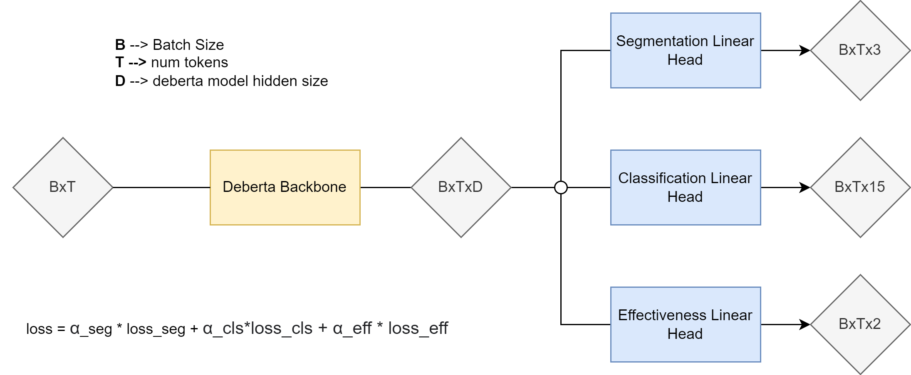

# RATER Competition Final Submission

This repo contains Kkiller (k.neroma) solution for the ***RATER Challenge***, hosted by **The Learning Agency LAB**. The competition focused on creating more efficient versions of the algorithms developed in the past Feedback Prize competition series. The task will be to develop an efficient “super-algorithm” that can Segment an essay into individual argumentative elements and evaluate the effectiveness of each discourse element. This task involves Natural Language Processing (NLP) and more precisely Token Classification.

Technically, our approach is based on a three-headed Microsoft Deberta model variants for token classification.

### 0. General notes
* All path specification is either absolute, either relative the project root foolder
* Organizer's required scripts are in ``scripts/`` folder
* It's highly recommended to execute the scripts from  the project root folder

The folders tree should look like (see ``tree.txt`` for full tree):

````
.
|-- .gitignore
|-- README.md
|-- data
|       |-- fold_dict.json
|       |-- submission.csv
|       |-- test.csv
|       |-- train.csv
|       |-- train_v2.csv
|		
|-- docs
|   `-- RATER Technical Documentation.pdf
|-- models
|   |-- old_db1l_xml1024/
|   |-- db1l_xml1024/
|   `-- db3l_xml1024/
|       
|-- requirements.txt
|-- scripts
|   |-- params/
|   |-- inference_script.py
|   |-- training_script.py
|-- setup.py
`-- src
    |-- rater
        |-- __init__.py
        |-- comp_metric.py
        |-- configs.py
        |-- dataset.py
        |-- inference.py
        |-- models.py
        |-- post_processing.py
        |-- script_utils.py
        |-- training.py
        |-- utils.py
       `-- wbf.py
````

### 1. Python 3.10.12 Installation
We run all our experiments under ***Python 3.10.12***. We highly recommend to run the scripts under this same settings even if they could (hopefully) run under different environments. Normally, the server is already parametrized with correct python and package versions. Environments are managed with `pyenv`, hence you can just need to active the `rater` python environment by doing:

````bash
pyenv activate rater
````

#### 1.1. Adding PyEnv to your system PATH
If it's your first connection to the server, pyenv could be ABSENT from your system PATH so you need to do this before running the above command:

````bash
export PYENV_ROOT="$HOME/.pyenv"
export PATH="$PYENV_ROOT/bin:$PATH"
eval "$(pyenv init -)"
eval "$(pyenv virtualenv-init -)"
````

#### 1.2. Installing Our project using setup-tools
If for anny reason, you my already set up ``rater`` environment is not working as expected, the requirements for this project can be installed (under the correct environment, please see the above section) by doing this from the project root:


````bash
pip install -e .
````

This will install all the requirements. Note that you need to install Python 3.10.12 before running the above command (see the below section).

#### 1.3. Installing PyEnv and Python 3.10.12
Normally you should not need this but if needed, you can (re)install PyEnv and Python.

* First, ensure that all the system requirements are installed by doing (as `root` user or add `sudo`):

````bash
apt-get update
apt-get install -y make build-essential libssl-dev zlib1g-dev \
    libbz2-dev libreadline-dev libsqlite3-dev wget curl llvm libncurses5-dev \
    libncursesw5-dev xz-utils tk-dev libffi-dev liblzma-dev
````

* Then intall pyenv by doing:

````bash
curl https://pyenv.run | bash
````

* Then install a system-wise python version:

````bash
pyenv install 3.10.12
````

* Then create your virtualenv

````bash
pyenv virtualenv 3.10.12 rater
````

* Then activate your virtualenv

````bash
pyenv activate rater
````

### 2. Hardware requirements
All the experiments have been conducted in python version 3.10.12. We train the model mainly on Google Colab (subscription + on the fly compute units acquisition). On Google Colab, when can (randomly) access A100 (40 Gb), V100 (16 Gb) or L4 (24 Gb) GPUs. Depending on the GPU, the batch size and the sequence maxlen could range from (2, 768)  to (6, 1024) with training time ranging from 1h30’ to 3h per epoch. During the last week of the competition, we also use the Learning Agency Lab provided GPU servers in order to make our results more reproducible.

### 3. Inference: making prediction with our model
All the script needed to make a prediction is in ``scripts/inference_script.py`` The `predict()` function is surely what you need.

For a fast demo run, set ``IS_DEBUG`` to ***True*** , just set it to ***False*** for inference on the whole test set. For the whole test set, the inference script should take around 25 minutes.

````bash
python scripts/inference_script.py --config_yaml_path scripts/params/demo_inference_params_db3s.yaml
````

The program should read the ``test.csv`` file from `$TEST_CSV_PATH` and save the predictions to `$SUB_CSV_SAVE_PATH`. For a real inference, please replace the demo yaml config by the right one (eg: `inference_params_db1l_db3l.yaml`)

**Notes:** Only two weights are used for the final inference (fold zero for ``deberta-v1-large`` and fold one for ``deberta-v3-large``). See instructins in the **training** section to reproduce these weights.

### 4. Modeling Approach
Our models are designed to predict three items (see diagram bellow):

* The token segmentation mask	
* The token level class	
* The token level effectiveness score	

 

Hence, each of our models is a three-headed model where each head is responsible for one task among the three mentioned above. We apply a cross-entropy loss (eventually with dynamic class weights) to each task and finally take a weighted sum as our final loss. Not only this modeling approach obviously account for all the aspects of this competition but also has the advantage of being fully trainable (as opposed to multi-step training approach), hence we’re sure to avoid the usual error propagation risk associated with multi step approaches.
It's also worth to be mentioned that no real post-processing has been done on raw outputs (except for effectiveness scores), indicating that there still room for improvements since by the old Feedback Prize competition, gradient boosting post-processing has been proved to be very effective.
Finally, let recall that we use many techniques for faster and effective model convergence:

* custom scheduling
* warm up
* gradient clipping
* multi-sample dropout
* token masking
* tokenizer augmentation by adding new tokens like <\n > & <\t >
* best weight checkpointing based on eval metrics
* mixed precision training
* weight decaying


### 5. Running the Training Script

Training is solely based on the provided data, no external data were used. However, for deberta-v1-large we initialize the model weights with old weights from Feedback Prize 2021. These old weights are the ones we used in our 5’th place solution. The old weights was publicly shared and [can be found here](https://www.kaggle.com/code/kneroma/gdrive-db1l-1024-v2-v11-no-pe-weights/output). The deberta-v3-large model was trained from scratch since no old weights were available to use. Given the good performance of the v3 models (after tokenizer tweaking), weight initialization should have limited impact.

To span a training session, just run:

````bash
python scripts/training_script.py  --config_yaml_path scripts/params/demo_training_params_db3s.yaml
````
Make sure to pass the right config files, the ones prepend by a ***demo_\**** are there just for fast testing.

As said above, only two weights are used for the final inference (fold zero for deberta-v1-large and fold one for deberta-v3-large). To reproduce the ``deberta-v1-large`` weights, just run:


````bash
python scripts/training_script.py  --config_yaml_path scripts/params/training_params_db1l.yaml
````

And to  reproduce the ``deberta-v3-large`` weights,  run:

````bash
python scripts/training_script.py  --config_yaml_path scripts/params/training_params_db3l.yaml
````