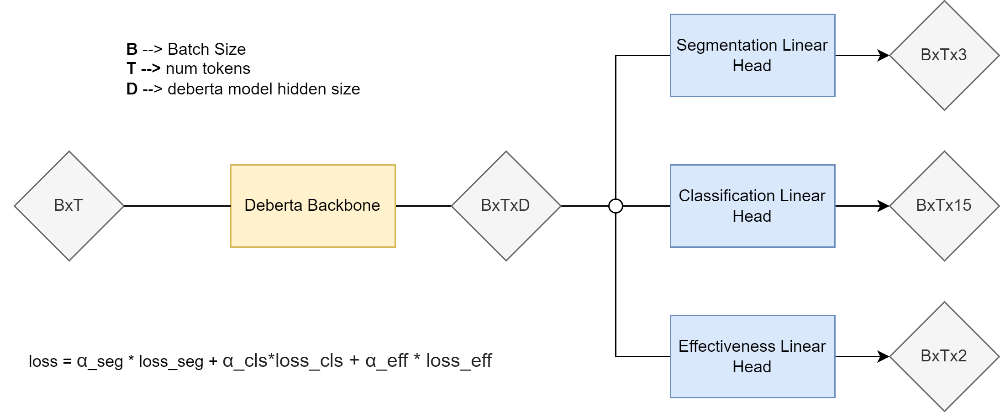

# RATER Competition Final Submission

This repo contains Kkiller solution for the ***RATER Challenge***, hosted by **The Learning Agency LAB**. The competition focused on creating more efficient versions of the algorithms developed in the past Feedback Prize competition series. The task consists in developping an efficient “super-algorithm” that can Segment an essay into individual argumentative elements and evaluate the effectiveness of each discourse element. This task involves Natural Language Processing (NLP) and more precisely Token Classification.

Technically, our approach is based on a three-headed Microsoft Deberta model variants for token classification (more on this later).

## 0. General notes
* All path specifications are either absolute, either relative to the project root foolder
* Organizer's required scripts are in ``scripts/`` folder
* It's highly recommended to execute the scripts from  the project root folder

The folders tree should look like :

````
.
|-- .gitignore
|-- README.md
|-- data
|       |-- fold_dict.json
|       |-- submission.csv
|       |-- test.csv
|       |-- train.csv
|       |-- train_v2.csv
|		
|-- docs
|   `-- RATER Technical Documentation.pdf
|-- models
|   |-- old_db1l_mxl1024/
|   |-- db1l_mxl1024/
|   `-- db3l_mxl1024/
|       
|-- requirements.txt
|-- scripts
|   |-- params/
|   |-- inference_script.py
|   |-- training_script.py
|-- setup.py
`-- src
    |-- rater
        |-- __init__.py
        |-- comp_metric.py
        |-- configs.py
        |-- dataset.py
        |-- inference.py
        |-- models.py
        |-- post_processing.py
        |-- script_utils.py
        |-- training.py
        |-- utils.py
       `-- wbf.py
````


## 1. Python 3.10.12 Installation
We run all our experiments under ***Python 3.10.12***. We highly recommend to run the scripts under this same settings even if they could (hopefully) run under different environments. Normally, the server is already parametrized with correct python and package versions. Environments are managed with `pyenv`, hence you can just need to active the `rater` python environment by doing:

````bash
pyenv activate rater
````

### 1.1. Adding PyEnv to your system PATH
If it's your first connection to the server, pyenv could be ABSENT from your system PATH so you need to do this before running the above command:

````bash
export PYENV_ROOT="$HOME/.pyenv"
export PATH="$PYENV_ROOT/bin:$PATH"
eval "$(pyenv init -)"
eval "$(pyenv virtualenv-init -)"
````

### 1.2. Installing Our project using setup-tools
If for anny reason, you my already set up ``rater`` environment is not working as expected, the requirements for this project can be installed (under the correct environment, please see the above section) by doing this from the project root:


````bash
pip install -e .
````

This will install all the requirements. Note that you need to install Python 3.10.12 before running the above command (see the below section).

### 1.3. Installing PyEnv and Python 3.10.12
Normally you should not need this but if needed, you can (re)install PyEnv and Python.

* First, ensure that all the system requirements are installed by doing (as `root` user or add `sudo`):

````bash
apt-get update
apt-get install -y make build-essential libssl-dev zlib1g-dev \
    libbz2-dev libreadline-dev libsqlite3-dev wget curl llvm libncurses5-dev \
    libncursesw5-dev xz-utils tk-dev libffi-dev liblzma-dev
````

* Then intall pyenv by doing:

````bash
curl https://pyenv.run | bash
````

* Then install a system-wise python version:

````bash
pyenv install 3.10.12
````

* Then create your virtualenv

````bash
pyenv virtualenv 3.10.12 rater
````

* Then activate your virtualenv

````bash
pyenv activate rater
````


## 2. Hardware Requirements
All experiments were conducted using Python version 3.10.12. Model training was primarily performed on Google Colab, utilizing both subscription-based and on-the-fly compute units. On Google Colab, we had access to various GPUs including A100 (40 GB), V100 (16 GB), and L4 (24 GB), though access to specific GPUs was randomized.

Depending on the GPU, the batch size and maximum sequence length varied, ranging from (2, 768) to (6, 1024). Consequently, the training time per epoch ranged from 1 hour 30 minutes to 3 hours. During the final week of the competition, we also leveraged GPU servers provided by Learning Agency Lab to enhance the reproducibility of our results.


## 3. Inference: Making Predictions with Our Model
All the necessary scripts for making predictions can be found in scripts/inference_script.py. The predict() function within this script is the primary tool you'll need.

To quickly run a demo, set IS_DEBUG to True. For full inference on the entire test set, change it to False. Running inference on the whole test set should take approximately 25 minutes.

To execute the inference script, use the following command:

````bash
python scripts/inference_script.py --config_yaml_path scripts/params/demo_inference_params_db3s.yaml
````

The program should read the ``test.csv`` file from `$TEST_CSV_PATH` and save the predictions to `$SUB_CSV_SAVE_PATH`. For a real inference, please replace the demo yaml config by the right one (eg: `inference_params_db1l_db3l.yaml`)

**Notes:** Only two weights are used for the final inference : fold zero for ``deberta-v1-large`` and fold one for ``deberta-v3-large``. See instructins in the **training** section to reproduce these weights.


## 4. Running the Training Script
Training is solely based on the provided data, no external data were used. However, for deberta-v1-large we initialize the model weights with old weights from Feedback Prize 2021. These old weights are the ones we used in our 5’th place solution. The old weights was publicly shared and [can be found here](https://www.kaggle.com/code/kneroma/gdrive-db1l-1024-v2-v11-no-pe-weights/output). The deberta-v3-large model was trained from scratch since no old weights were available to use. Given the good performance of the v3 models (after tokenizer tweaking), weight initialization should have limited impact.

To span a training session, just run:

````bash
python scripts/training_script.py  --config_yaml_path scripts/params/demo_training_params_db3s.yaml
````
Please ensure to use the correct configuration files. The ones prefixed with ***demo_\**** are provided solely for quick testing purposes.

As said above, only two weights are used for the final inference : fold zero for deberta-v1-large and fold one for deberta-v3-large. To reproduce the ``deberta-v1-large`` weights, just run:


````bash
python scripts/training_script.py  --config_yaml_path scripts/params/training_params_db1l.yaml
````

And to  reproduce the ``deberta-v3-large`` weights,  run:

````bash
python scripts/training_script.py  --config_yaml_path scripts/params/training_params_db3l.yaml
````


## 5. Modeling Approach
Our models are designed to predict three specific items, as illustrated in the diagram below:

* The token-level class
* The token segmentation mask
* The token-level effectiveness score	

 

Each of our models is a three-headed architecture, with each head dedicated to one of the tasks mentioned above (see next section for more details). We utilize a cross-entropy loss function (potentially with dynamic class weights) for each task, and our final loss is a weighted sum of these individual losses. This modeling strategy not only comprehensively addresses all aspects of the competition but also offers the advantage of being fully trainable in a single step. This approach mitigates the typical error propagation risks associated with multi-step training methods.


It is important to note that minimal post-processing has been applied to the raw outputs, except for the effectiveness scores. This indicates potential for further improvements, as previous competitions (such as the Feedback Prize) have demonstrated the efficacy of gradient boosting for post-processing.

Finally, we have employed various techniques to achieve faster and more effective model convergence, including:

* Tokenizer augmentation with additional tokens like <\n> and <\t>
* Custom learning rate scheduling & warm-up
* Weight decay
* Gradient clipping
* Multi-sample dropout
* Token masking
* Best weight checkpointing based on evaluation metrics
* Mixed precision training

These techniques collectively enhance the performance and efficiency of our models. For more details on each these techniques, please below point.

### 5.1. Three-headed deberta architecture
#### 5.1.0. DeBERTa architecture
DeBERTa is a now old transformer architecture introduced in 2020 by He & Al in [DeBERTa: Decoding-enhanced BERT with Disentangled Attention](https://arxiv.org/abs/2006.03654). It mainly introduces a *disentangled attention mechanism, where each word is represented using two vectors that encode its content and position, respectively, and the attention weights among words are computed using disentangled matrices on their contents and relative positions*. DeBERTa usually perform better than BERT and its variants like RoBERTa. While several implementations of the DeBERTa architecture are available accross the Web, we use here the one from [HuggingFace](https://huggingface.co/docs/transformers/model_doc/deberta). This will be the backbone of our models, on top of which we'll put 3 classification heads.

Generally, inputs of the model wil be a batch of texts. Let assume ***B*** is the batch-size (ie the number input texts), we will transform each text input into a list of the so called `tokens`. A token is just a sub-word and usually allow to encode the textual input into a numerical one. For faster computation, shorter inputs are padded using the `padding_token` and the **tokenized** inputs will finally be a tensor of shape **BxT**. This tokens will be  fed into the DeBERTa model, leading to a **BxTxD** embeddings where **D** is the embedding dimension of the DeBERTa model (D=768 for the small version, D=1024 for the large one). Finally, these **BxTxD** embeddings will pass through the dedicated classification heads in order to have the final scores.

**NOTES** : Due to the use of the multi-sample dropout, which is a technique to make convergence faster, an additional dimension should be added to he above tensors : instead of B ==> BxT ==> BxTxD, we will have B ==> BxT ==> BxMxTxD, where M is the number of different dropout rates. Please see `models.Model.formward()` for the real implementation.

### 5.1.1. Token-level Class Prediction
The primary task of this challenge is to classify each segment of an essay into one of the seven provided categories, effectively extending this classification to the token level. This approach aligns with a Token Classification task, commonly referred to as **Named Entity Recognition (NER)**.

To achieve this, we employ a classification head atop the DeBERTa model. This `linear layer` produces 15 distinct scores:

* Scores 1 to 7: Correspond to the Beginning of each entity type (B-Claim, B-ConcludingStatement, B-Counterclaim, B-Evidence, B-Lead, B-Position, B-Rebuttal).
* Scores 8 to 14: Correspond to the Inside of each entity type (I-Claim, I-ConcludingStatement, I-Counterclaim, I-Evidence, I-Lead, I-Position, I-Rebuttal).
* Score 15: Represents tokens outside of any entity.

This setup follows the [IOB format](https://en.wikipedia.org/wiki/Inside%E2%80%93outside%E2%80%93beginning_(tagging)).

#### 5.1.2. Token-Level Segmentation Mask
Text segmentation is one of the key part of this challenge. While segmentation output can be directly derived from the above **NER** approach, we decided to incorporate a dedicated segmentation head into our model for better and more reliabel segmentation. The segmentation head is a simple linear layer and outputs 3 scores:

* 1st score ==> At the beginning of any Entity
* 2nd score ==> Inside an Entity
* 3rd score ==> Outside

The target for this task if consequently directly computed from the NER target.

#### 5.1.3. Token-level Effectiveness Score
Effectiveness score is the third and last part of this challenge. We handle it by simply adding a third linear head, outputing 2 scores to our DeBERTa model.


### 5.2. Tokenizer Augmentation
We enhanced the tokenizer to include special tokens such as <\n> and <\t>, allowing the model to better capture and understand newline and tab characters within text. This modification aids in preserving the original structure of the input data, leading to improved downstream task performance. The updated tokenizer is seamlessly integrated into the preprocessing pipeline to ensure consistency across training and inference phases.

### 5.3. Custom Learning Rate Scheduling & Warm-up
A custom learning rate schedule was implemented to dynamically adjust the learning rate during training, incorporating a warm-up phase at the beginning. This technique helps in stabilizing training, particularly during the initial stages, by gradually increasing the learning rate to its peak value. The scheduler then follows a cosine-decay pattern, optimizing the convergence speed and overall model performance.

### 5.4. Weight Decay
We applied weight decay to the optimizer to regularize the model and prevent overfitting. This technique penalizes large weights, promoting simpler models that generalize better on unseen data. The weight decay parameter was carefully tuned to balance regularization strength and model capacity.

### 5.5. Gradient Clipping
Gradient clipping was employed to mitigate the risk of exploding gradients. By setting a threshold value (2.0 in our case), gradients exceeding this limit are scaled down, ensuring stable and efficient training. This technique is crucial for maintaining numerical stability and achieving faster convergence.

### 5.6. Multi-Sample Dropout
Multi-sample dropout was utilized to enhance model robustness by averaging the predictions from multiple dropout masks within a single forward pass. This method improves generalization by preventing the model from becoming overly reliant on specific neurons. It also provides a form of implicit ensemble, reducing the risk of overfitting and accelerate the convergence rate.

### 5.7. Token Masking
Token masking was introduced during training to randomly mask certain tokens within the input sequences, encouraging the model to learn context and relationships between tokens. This technique is particularly effective for tasks involving language modeling and sequence prediction. Its meant to promote the development of more robust representations that can handle missing or corrupted data.

### 5.8. Best Weight Checkpointing Based on Evaluation Metrics
The training process includes a mechanism for saving the model's weights at checkpoints where it achieves the best performance according to competition metric. This ensures that the best-performing model, rather than the last one, is used for inference. Checkpointing is automated and integrated with the training loop for efficiency.

### 5.9. Mixed Precision Training
Mixed precision training was adopted to accelerate training by utilizing both 16-bit and 32-bit floating-point types. This approach reduces memory consumption and speeds up computations without compromising model accuracy. The implementation leverages hardware accelerators and libraries optimized for mixed precision operations. All of this is done, of course, using Pytorch.

